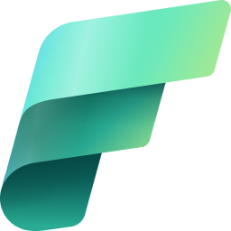
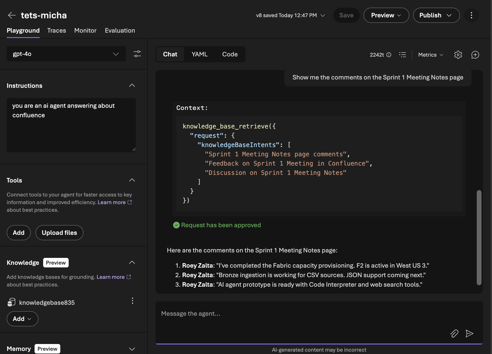

<p align="center">
  
  &nbsp;&nbsp;&nbsp;
  
</p>

# Fabric ETL + AI Foundry — Medallion Architecture E2E Project

End-to-end data platform combining **Azure Fabric** (OneLake Medallion Architecture),
a Python **ETL pipeline**, and an **Azure AI Foundry** agent for automated data analysis.

A single `azd up` command provisions all Azure resources, deploys Fabric notebooks and
Data Factory pipeline, seeds Confluence with sample data, runs the ETL, indexes data into
Azure AI Search, and creates an AI Foundry agent connected to OneLake.

## Deploy with `azd up`

### Prerequisites

- [Azure Developer CLI (`azd`)](https://aka.ms/azd-install) v1.5+
- [Azure CLI (`az`)](https://learn.microsoft.com/cli/azure/install-azure-cli) v2.60+
- Python 3.10+
- An Azure subscription with:
  - **Microsoft Fabric** resource provider registered
  - **Cognitive Services** resource provider registered
  - Permissions to create resource groups and role assignments
- A **Confluence Cloud** instance with an API token ([create one here](https://id.atlassian.com/manage-profile/security/api-tokens))

### One-Command Deployment

```bash
# Clone the repo
git clone https://github.com/msftse/fabric-etl-ai-foundry.git
cd fabric-etl-ai-foundry

# Log in to Azure
azd auth login
az login

# Deploy everything
azd up
```

`azd up` will prompt you for:
- **Environment name** — used as a suffix for all resource names
- **Azure location** — region for resource deployment (e.g. `westus3`)
- **Fabric admin email** — your Azure AD email for Fabric capacity admin
- **Confluence URL** — your Confluence Cloud URL (e.g. `https://yoursite.atlassian.net/wiki`)
- **Confluence email** — your Atlassian account email
- **Confluence API token** — your Confluence API token

### What Gets Deployed

**Phase 1 — `azd provision` (Bicep)** creates Azure resources:

| Resource | Bicep Module | Purpose |
|----------|-------------|---------|
| Microsoft Fabric Capacity (F2) | `fabric-capacity.bicep` | Compute for Fabric workspace |
| Azure AI Search (Standard) | `ai-search.bicep` | Index OneLake data with managed identity |
| Azure AI Services + gpt-4o | `openai.bicep` | Chat model + embeddings for AI agent |
| Storage Account | `storage.bicep` | Backing store for AI Foundry Hub |
| Key Vault | `keyvault.bicep` | Secrets for AI Foundry Hub |
| AI Foundry Hub + Project | `ai-foundry.bicep` | AI agent hosting environment |

**Phase 2 — `postprovision` hooks** run 7 Python scripts:

| Script | Purpose |
|--------|---------|
| `01_setup_fabric.py` | Create Fabric workspace + lakehouse via REST API |
| `02_deploy_notebooks.py` | Deploy 3 medallion notebooks + Data Factory pipeline |
| `03_seed_and_run_etl.py` | Seed Confluence with sample data + trigger pipeline |
| `04_setup_rbac.py` | Grant AI Search managed identity access to Fabric + OpenAI |
| `05_setup_search_index.py` | Create AI Search index, OneLake data source, indexer |
| `06_create_agent.py` | Create AI Foundry agent with AzureAISearchTool |
| `07_setup_security_filters.py` | Demonstrate document-level access control with security filters |

### Tear Down

```bash
azd down --purge
```

### GitHub Codespaces

This repo includes a `.devcontainer` configuration. Click **Code > Codespaces > New codespace** on GitHub to get a ready-to-use environment with `azd`, `az`, and Python pre-installed.

## Architecture

```
                         azd up
                           │
            ┌──────────────┴──────────────┐
            ▼                              ▼
    Phase 1: Bicep                Phase 2: Python Scripts
    (ARM Resources)               (Data-Plane Resources)
    ┌─────────────────┐           ┌──────────────────────┐
    │ Fabric Capacity  │           │ Fabric Workspace     │
    │ AI Search        │           │ Fabric Lakehouse     │
    │ AI Services      │──outputs─>│ 3 Notebooks          │
    │ Storage Account  │  (env)    │ Data Factory Pipeline│
    │ Key Vault        │           │ Confluence Seed + ETL│
    │ AI Hub + Project │           │ RBAC Assignments     │
    └─────────────────┘           │ Search Index+Indexer │
                                   │ AI Foundry Agent     │
                                   └──────────────────────┘
```

```
┌─────────────────────────────────────────────────────────────────────┐
│                        AZURE FABRIC CAPACITY                        │
├─────────────────────────────────────────────────────────────────────┤
│                                                                     │
│  ┌──────────┐     ┌──────────┐     ┌──────────┐                   │
│  │  BRONZE   │────>│  SILVER   │────>│   GOLD   │                   │
│  │  (Raw)    │     │ (Cleansed)│     │(Aggregated)│                  │
│  └──────────┘     └──────────┘     └─────┬────┘                   │
│       │                                    │                        │
│  OneLake DFS   <──── Parquet + CSV ────>  │                        │
│                                            │                        │
├────────────────────────────────────────────┼────────────────────────┤
│                                            │                        │
│  ┌─────────────────────────────────────────▼──────────────────┐    │
│  │              AZURE AI FOUNDRY AGENT                         │    │
│  │  ┌───────────────┐  ┌──────────────┐  ┌───────────────┐   │    │
│  │  │Knowledge Base  │  │Code Interpret│  │  Bing Search  │   │    │
│  │  │(AI Search +    │  │ (charts/calc)│  │  (context)    │   │    │
│  │  │ OneLake Index) │  └──────────────┘  └───────────────┘   │    │
│  │  └───────────────┘                                         │    │
│  └────────────────────────────────────────────────────────────┘    │
│                                                                     │
└─────────────────────────────────────────────────────────────────────┘
```

## Project Structure

```
fabric-etl-ai-foundry/
├── azure.yaml                           # azd project config with postprovision hooks
├── infra/
│   ├── main.bicep                       # Bicep orchestrator (6 modules, ~20 outputs)
│   ├── main.parameters.json             # Default params with azd env var references
│   └── modules/
│       ├── fabric-capacity.bicep        # Microsoft.Fabric/capacities (F2)
│       ├── ai-search.bicep              # AI Search with managed identity
│       ├── openai.bicep                 # AI Services + gpt-4o deployment
│       ├── storage.bicep                # Storage account for AI Foundry
│       ├── keyvault.bicep               # Key Vault for AI Foundry
│       └── ai-foundry.bicep             # AI Hub + AIServices connection + Project
├── scripts/postprovision/
│   ├── _helpers.py                      # Shared utilities (azd env, FabricClient)
│   ├── 01_setup_fabric.py              # Fabric workspace + lakehouse
│   ├── 02_deploy_notebooks.py          # Notebook + pipeline deployment
│   ├── 03_seed_and_run_etl.py          # Confluence seed + pipeline trigger
│   ├── 04_setup_rbac.py                # RBAC role assignments
│   ├── 05_setup_search_index.py        # AI Search index/datasource/indexer
│   ├── 06_create_agent.py              # AI Foundry agent creation
│   └── 07_setup_security_filters.py    # Document-level access control demo
├── docs/
│   ├── security-index-access.md        # Security module: document-level access control
│   └── images/                         # Architecture screenshots
├── notebooks/
│   ├── bronze_confluence_extract.ipynb  # Bronze notebook ({{PLACEHOLDER}} tokens)
│   ├── silver_confluence_transform.ipynb # Silver notebook
│   └── gold_confluence_aggregation.ipynb # Gold notebook
├── .devcontainer/
│   └── devcontainer.json               # GitHub Codespaces config
├── main.py                              # CLI entry point (12 commands)
├── requirements.txt
├── .env.example
├── config/
│   └── settings.py                      # Typed configuration from env vars
├── data/
│   └── sample/
│       └── orders.csv                   # Sample e-commerce order data
├── src/
│   ├── confluence/
│   │   ├── client.py                    # Confluence REST API extraction client
│   │   └── seeder.py                    # Sample data seeder (creates demo content)
│   ├── fabric/
│   │   ├── deployer.py                  # Fabric REST API deployer (notebooks + pipeline)
│   │   └── notebook_content.py          # Notebook .ipynb file loader
│   ├── infrastructure/
│   │   └── fabric_provisioner.py        # Fabric capacity CRUD (azure-mgmt-fabric)
│   ├── onelake/
│   │   └── client.py                    # OneLake DFS read/write (Parquet + CSV)
│   ├── etl/
│   │   ├── bronze/
│   │   │   ├── ingestion.py             # Raw CSV -> Parquet ingestion
│   │   │   └── confluence_ingestion.py  # Confluence -> Bronze (Parquet)
│   │   ├── silver/
│   │   │   ├── transform.py            # Orders cleansing, dedup, type casting
│   │   │   └── confluence_transform.py  # HTML stripping, date parsing (Parquet + CSV)
│   │   └── gold/
│   │       ├── aggregation.py           # Orders business aggregations
│   │       └── confluence_aggregation.py # Confluence aggregations (Parquet + CSV)
│   ├── ai_agent/
│   │   └── analyst.py                   # AI Foundry data analyst agent
│   ├── orchestrator.py                  # E2E pipeline coordinator
│   └── utils/
│       └── logging.py                   # Structured logging
└── tests/                               # (placeholder)
```

## Quick Start (CLI — manual mode)

> **Prefer `azd up`?** See [Deploy with azd up](#deploy-with-azd-up) above for the automated path.
>
> The CLI below is useful for running individual steps against an **existing** Fabric workspace.

### 1. Install dependencies

```bash
pip install -r requirements.txt
```

### 2. Configure environment

```bash
cp .env.example .env
# Edit .env with your Azure and Confluence credentials (see "Environment Variables" below)
```

### 3. Run the CSV ETL pipeline

```bash
python main.py etl --source data/sample/orders.csv
```

### 4. Ask the AI analyst a question

```bash
python main.py ask --source data/sample/orders.csv \
  -q "Which country generates the most revenue and why?"
```

### 5. Get structured analysis

```bash
python main.py ask --source data/sample/orders.csv \
  -q "Summarize the sales performance" --structured
```

### 6. Interactive chat

```bash
python main.py chat --source data/sample/orders.csv
```

### 7. Stream a response

```bash
python main.py stream --source data/sample/orders.csv \
  -q "Provide a comprehensive analysis of the data"
```

### 8. Full E2E pipeline (infra + ETL + AI)

```bash
python main.py full --source data/sample/orders.csv --provision
```

### 9. Manage infrastructure

```bash
python main.py provision   # Create / resume Fabric capacity
python main.py suspend     # Pause capacity (stops billing)
```

### 10. Confluence ETL pipeline

```bash
# Seed Confluence with sample data (optional — creates ETLDEMO space with pages/comments)
python main.py confluence-seed

# Run the full Confluence ETL: Extract -> Bronze -> Silver -> Gold in OneLake
python main.py confluence-etl
```

### 11. Deploy Fabric Data Factory pipeline

```bash
# Deploy notebooks + pipeline to Fabric workspace (idempotent — creates or updates)
python main.py deploy-pipeline
```

### 12. Run the pipeline in Fabric

```bash
# Trigger an on-demand run
python main.py run-pipeline

# Check run status
python main.py pipeline-status --pipeline-id <PIPELINE_ID> --job-id <JOB_ID>
```

## Confluence ETL Pipeline

The Confluence pipeline extracts **all spaces, pages, and comments** from a Confluence Cloud instance and loads them into OneLake using the Medallion Architecture.

### Data Flow

```
Confluence Cloud REST API
        │
        ▼
┌──────────────┐     ┌──────────────┐     ┌──────────────┐
│    BRONZE     │────>│    SILVER     │────>│     GOLD      │
│ Raw JSON data │     │ HTML stripped  │     │ Aggregations  │
│ (Parquet)     │     │ Dates parsed   │     │ (Parquet+CSV) │
│               │     │ Deduped        │     │               │
│ - spaces      │     │ (Parquet+CSV)  │     │ - content by  │
│ - pages       │     │                │     │   space       │
│ - comments    │     │ - spaces       │     │ - author      │
│               │     │ - pages        │     │   activity    │
│               │     │ - comments     │     │ - content     │
│               │     │                │     │   timeline    │
│               │     │                │     │ - most        │
│               │     │                │     │   discussed   │
└──────────────┘     └──────────────┘     └──────────────┘
```

### Why Parquet AND CSV?

The Silver and Gold layers write **both** Parquet and CSV files:
- **Parquet** — efficient columnar format for analytics queries
- **CSV** — required for Azure AI Search indexing (AI Search does NOT support Parquet)

This dual-write enables the AI Foundry agent's knowledge base to index and search the data.

## Azure Setup (Manual Steps — alternative to `azd up`)

The following Azure resources and configurations must be set up **before** running the pipeline. These are one-time setup steps.

### Step 0: Deploy Fabric Data Factory Pipeline (Optional)

As an alternative to running the ETL locally via `python main.py confluence-etl`, you can deploy the pipeline as **Fabric-native Notebooks + Data Factory pipeline** that runs entirely inside the Fabric workspace.

```
Pipeline: ConfluenceETL
  ┌──────────────────┐     ┌──────────────────┐     ┌──────────────────┐
  │ Bronze Notebook   │────>│ Silver Notebook   │────>│ Gold Notebook     │
  │ (Extract from     │     │ (HTML strip, parse│     │ (Aggregate, write │
  │  Confluence API,  │     │  dates, dedup,    │     │  Parquet + CSV)   │
  │  write Parquet)   │     │  write Parquet+CSV│     │                   │
  └──────────────────┘     └──────────────────┘     └──────────────────┘
```

**How it works:**

1. Three self-contained Python notebooks (one per medallion layer) are deployed to the workspace
2. A Data Factory pipeline chains them in sequence: Bronze -> Silver -> Gold
3. Each notebook reads/writes via the lakehouse mount point (`/lakehouse/default/Files/`)
4. The Bronze notebook receives Confluence credentials as parameters from the pipeline
5. Everything is deployed programmatically via the Fabric REST API — no portal clicks

**Deploy and run:**

```bash
# Deploy notebooks + pipeline (idempotent — creates or updates)
python main.py deploy-pipeline

# Trigger an on-demand run
python main.py run-pipeline

# Check status
python main.py pipeline-status --pipeline-id <ID> --job-id <JOB_ID>
```

The deployer (`src/fabric/deployer.py`) also supports **scheduling** via the Fabric Job Scheduler API for recurring runs.

### Step 1: Create a Fabric Workspace

Personal workspaces ("My workspace") do **not** support managed access or external service connections. You must create a named workspace.

```bash
# Create a named workspace (not "My workspace")
curl -s -X POST "https://api.fabric.microsoft.com/v1/workspaces" \
  -H "Authorization: Bearer $(az account get-access-token --resource https://api.fabric.microsoft.com --query accessToken -o tsv)" \
  -H "Content-Type: application/json" \
  -d '{"displayName": "confluence-etl"}'
```

Save the returned workspace `id` as `FABRIC_WORKSPACE_ID` in `.env`.

### Step 2: Assign Workspace to Fabric Capacity

```bash
# Assign workspace to your Fabric capacity
curl -s -X POST "https://api.fabric.microsoft.com/v1/workspaces/<WORKSPACE_ID>/assignToCapacity" \
  -H "Authorization: Bearer $(az account get-access-token --resource https://api.fabric.microsoft.com --query accessToken -o tsv)" \
  -H "Content-Type: application/json" \
  -d '{"capacityId": "<CAPACITY_ID>"}'
```

### Step 3: Create a Lakehouse

Lakehouse names **cannot contain hyphens** (e.g. `confluence-lakehouse` will fail).

```bash
curl -s -X POST "https://api.fabric.microsoft.com/v1/workspaces/<WORKSPACE_ID>/lakehouses" \
  -H "Authorization: Bearer $(az account get-access-token --resource https://api.fabric.microsoft.com --query accessToken -o tsv)" \
  -H "Content-Type: application/json" \
  -d '{"displayName": "confluencelakehouse"}'
```

Save the returned lakehouse `id` as `FABRIC_LAKEHOUSE_ID` in `.env`.

### Step 4: Create an Azure AI Search Service

Create an AI Search service (Standard SKU or higher recommended):

```bash
az search service create \
  --name <SEARCH_SERVICE_NAME> \
  --resource-group <RESOURCE_GROUP> \
  --sku standard \
  --location <LOCATION>
```

### Step 5: Enable AI Search Managed Identity

The AI Search service needs a system-assigned managed identity to access OneLake and Azure OpenAI:

```bash
az search service update \
  --name <SEARCH_SERVICE_NAME> \
  --resource-group <RESOURCE_GROUP> \
  --identity-type SystemAssigned
```

Note the returned `principalId` — you'll need it for the next steps.

### Step 6: Grant AI Search Access to Fabric Workspace

Grant the AI Search managed identity **Contributor** role on the Fabric workspace so it can read OneLake data:

```bash
# Get an access token for the Fabric API
TOKEN=$(az account get-access-token --resource https://api.fabric.microsoft.com --query accessToken -o tsv)

# Grant Contributor role to the AI Search service principal
curl -s -X POST "https://api.fabric.microsoft.com/v1/workspaces/<WORKSPACE_ID>/roleAssignments" \
  -H "Authorization: Bearer $TOKEN" \
  -H "Content-Type: application/json" \
  -d '{
    "principal": {
      "id": "<AI_SEARCH_PRINCIPAL_ID>",
      "type": "ServicePrincipal"
    },
    "role": "Contributor"
  }'
```

### Step 7: Grant AI Search Access to Azure OpenAI (Embeddings)

The AI Search indexer uses Azure OpenAI embeddings for vector search. The managed identity needs the **"Cognitive Services OpenAI User"** role:

```bash
az role assignment create \
  --assignee-object-id <AI_SEARCH_PRINCIPAL_ID> \
  --assignee-principal-type ServicePrincipal \
  --role "Cognitive Services OpenAI User" \
  --scope /subscriptions/<SUBSCRIPTION_ID>/resourceGroups/<RESOURCE_GROUP>/providers/Microsoft.CognitiveServices/accounts/<AI_RESOURCE_NAME>
```

> **This step is critical.** Without it, the AI Search indexer will fail with `PermissionDenied` errors when trying to generate embeddings for the CSV documents.

### Step 8: Create AI Foundry Agent with Knowledge Base

1. Go to **Azure AI Foundry** portal
2. Open your project
3. Create a new **Agent** with a deployed chat model (e.g. `gpt-4o`)
4. Add a **Knowledge Base**:
   - Click "Create new" > "Microsoft OneLake"
   - Enter the **Workspace ID** and **Lakehouse ID** from your `.env`
   - Select the AI Search service created above as the search resource
   - Wait for the knowledge source status to change from "Creating" to "Ready"
5. Configure the knowledge base:
   - **Chat completions model**: your deployed model (e.g. `gpt-4o`)
   - **Retrieval reasoning effort**: `Medium` or `High` (not Minimal)
   - **Output mode**: `Generated` for natural-language answers, or `Extractive data` for raw snippets
   - **Retrieval instructions**: `Search the Confluence ETL data for pages, comments, spaces, author activity, and content aggregations. Prioritize silver and gold layer data for cleaned and aggregated results.`
6. Save the knowledge base

Below is the agent playground after successful setup — the knowledge base retrieves Confluence data and answers questions:



### Troubleshooting

| Symptom | Cause | Fix |
|---------|-------|-----|
| Agent returns "I'm unable to access details" | AI Search indexer hasn't indexed data or failed | Check indexer status (see below) |
| Indexer errors: `PermissionDenied` on embeddings | AI Search identity missing OpenAI RBAC | Run Step 7 above, wait 5 min for propagation, reset & re-run indexer |
| Indexer warnings: `unsupported content type application/x-parquet` | Normal — Parquet files are skipped by AI Search | Not an error. CSV files are the ones that get indexed. |
| Indexer warnings: `SplitSkill input missing` | Side-effect of Parquet files having no extractable text | Normal for Parquet files, no action needed |
| Lakehouse creation fails with "invalid name" | Hyphens in lakehouse name | Use only alphanumeric characters (e.g. `confluencelakehouse`) |
| Workspace doesn't support managed access | Using personal "My workspace" | Create a named workspace (Step 1) |
| Security filter returns no results | User groups not present in `allowed_groups` field | Verify group names match exactly; always include `'all'` in effective groups |
| Security filter test FAIL in script 07 | Index propagation delay | Increase the `time.sleep` value in `07_setup_security_filters.py` before re-running |

#### Checking Indexer Status via API

```bash
# Get the AI Search admin key
SEARCH_KEY=$(az search admin-key show \
  --service-name <SEARCH_SERVICE_NAME> \
  --resource-group <RESOURCE_GROUP> \
  --query primaryKey -o tsv)

# List all indexers
curl -s -H "api-key: $SEARCH_KEY" \
  "https://<SEARCH_SERVICE_NAME>.search.windows.net/indexers?api-version=2024-07-01"

# Check a specific indexer's execution status
curl -s -H "api-key: $SEARCH_KEY" \
  "https://<SEARCH_SERVICE_NAME>.search.windows.net/indexers/<INDEXER_NAME>/status?api-version=2024-07-01"

# Reset and re-run an indexer (after fixing RBAC or data issues)
curl -s -X POST -H "api-key: $SEARCH_KEY" -H "Content-Length: 0" \
  "https://<SEARCH_SERVICE_NAME>.search.windows.net/indexers/<INDEXER_NAME>/reset?api-version=2024-07-01"

curl -s -X POST -H "api-key: $SEARCH_KEY" -H "Content-Length: 0" \
  "https://<SEARCH_SERVICE_NAME>.search.windows.net/indexers/<INDEXER_NAME>/run?api-version=2024-07-01"
```

## Medallion Layers

### Orders (CSV source)

| Layer | Purpose | Location in OneLake |
|-------|---------|---------------------|
| **Bronze** | Raw ingestion with metadata (`_ingested_at`, `_source_file`) | `Files/bronze/orders/data.parquet` |
| **Silver** | Cleansed: type casting, dedup, derived `total_amount`, filter cancelled | `Files/silver/orders/data.parquet` |
| **Gold** | Aggregated: `revenue_by_country`, `revenue_by_category`, `daily_revenue`, `top_customers` | `Files/gold/<table>/data.parquet` |

### Confluence (API source)

| Layer | Purpose | Location in OneLake |
|-------|---------|---------------------|
| **Bronze** | Raw Confluence data with ingestion metadata | `Files/bronze/confluence_<entity>/data.parquet` |
| **Silver** | HTML stripped, dates parsed, word counts, deduplicated | `Files/silver/confluence_<entity>/data.parquet` + `data.csv` |
| **Gold** | Business aggregations for analytics and AI Search | `Files/gold/confluence_<table>/data.parquet` + `data.csv` |

**Confluence Bronze entities**: `confluence_spaces`, `confluence_pages`, `confluence_comments`

**Confluence Gold tables**:

| Table | Description |
|-------|-------------|
| `confluence_content_by_space` | Page count, total words, avg word count per space |
| `confluence_author_activity` | Pages and comments per author, total words written |
| `confluence_content_timeline` | Content creation aggregated by date |
| `confluence_most_discussed` | Pages ranked by comment count |

## Environment Variables

Copy `.env.example` to `.env` and fill in:

| Variable | Required | Description |
|----------|----------|-------------|
| `AZURE_SUBSCRIPTION_ID` | Yes | Azure subscription ID |
| `AZURE_RESOURCE_GROUP` | Yes | Resource group for Fabric capacity |
| `FABRIC_CAPACITY_NAME` | No | Fabric capacity name (default: `etl-fabric-capacity`) |
| `FABRIC_LOCATION` | No | Azure region (default: `eastus`) |
| `FABRIC_SKU` | No | Capacity SKU (default: `F2`) |
| `FABRIC_ADMIN_EMAIL` | Yes | Admin email for Fabric capacity |
| `FABRIC_WORKSPACE_ID` | Yes | Workspace ID (from Step 1) |
| `FABRIC_LAKEHOUSE_ID` | Yes | Lakehouse ID (from Step 3) |
| `ONELAKE_WORKSPACE_NAME` | Yes | Workspace display name |
| `ONELAKE_LAKEHOUSE_NAME` | Yes | Lakehouse display name |
| `AZURE_AI_PROJECT_ENDPOINT` | Yes | AI Foundry project endpoint URL |
| `AZURE_AI_MODEL_DEPLOYMENT_NAME` | No | Model deployment name (default: `gpt-4o`) |
| `CONFLUENCE_URL` | For Confluence | Confluence Cloud URL (e.g. `https://yoursite.atlassian.net/wiki`) |
| `CONFLUENCE_EMAIL` | For Confluence | Atlassian account email |
| `CONFLUENCE_API_TOKEN` | For Confluence | Confluence API token ([create one here](https://id.atlassian.com/manage-profile/security/api-tokens)) |

## AI Agent Capabilities

The AI Foundry agent can be configured with:

- **Knowledge Base** grounded on OneLake data via AI Search (recommended for Confluence data)
- **5 function tools** that query gold-layer data (for CSV/orders pipeline)
- **Code Interpreter** for running Python calculations and generating matplotlib charts
- **Bing Web Search** (optional) for market context
- **Structured output** mode returning `DataInsight` Pydantic models
- **Streaming** for real-time responses
- **Multi-turn threads** for conversational analysis

## Securing Data Access in the Index

By default every user with access to the AI Foundry agent can retrieve any indexed document. The security module adds **document-level access control** so that query results are trimmed to documents the caller is authorized to see.

Full documentation: [docs/security-index-access.md](docs/security-index-access.md)

### Approach: Security Filters (String Comparison)

A filterable `allowed_groups` field is added to each indexed document at the Gold-layer ETL step. At query time the application injects an OData `$filter` expression that restricts results to documents tagged with the caller's group identifiers.

```
Gold CSV (OneLake)            AI Search Index            Query
  allowed_groups:               allowed_groups            $filter:
  ["team-data-eng", "all"]  -->  (filterable)  -->  allowed_groups/any(g: g eq 'team-data-eng')
                                                     or allowed_groups/any(g: g eq 'all')
```

Key components:

| Component | Location | What It Does |
|---|---|---|
| Security field definition | `07_setup_security_filters.py` | Creates `Collection(Edm.String)` field with `filterable: true` |
| Sample documents | `07_setup_security_filters.py` | Pushes Confluence-style docs with group tags; verifies filter enforcement |
| OData filter builder | `07_setup_security_filters.py` | Generates `allowed_groups/any(g: g eq '...')` expressions |
| Group-to-space mapping | `docs/security-index-access.md` | Example mapping to stamp groups onto Gold-layer CSV |
| Entra group resolution | `docs/security-index-access.md` | Microsoft Graph API pattern to retrieve user group membership at runtime |

### Running the Security Demo

After `azd up` completes (or manually after step 06):

```bash
python scripts/postprovision/07_setup_security_filters.py
```

The script creates a `confluence-secure-demo` index, pushes five sample documents with different group restrictions, and runs three test scenarios to confirm security trimming works correctly.

### Upgrade Path: Native RBAC Enforcement (Preview)

For production deployments on Azure Data Lake Storage Gen2 (the backing store for OneLake), Azure AI Search supports **native POSIX-like ACL and RBAC scope enforcement** (preview). This eliminates the need to manually tag documents with group identifiers — the service pulls ACLs directly from ADLS Gen2 during indexing and enforces them at query time using the caller's Entra token:

```http
POST /indexes/<index>/docs/search?api-version=2025-11-01-preview
Authorization: Bearer <search-rbac-token>
x-ms-query-source-authorization: Bearer <user-entra-token>
```

See [docs/security-index-access.md#upgrading-to-native-rbac-scopes](docs/security-index-access.md#upgrading-to-native-rbac-scopes) for the full upgrade guide.

**References:**
- [Document-level access control — Azure AI Search](https://learn.microsoft.com/en-us/azure/search/search-document-level-access-overview)
- [Query-time ACL and RBAC enforcement — Azure AI Search](https://learn.microsoft.com/en-us/azure/search/search-query-access-control-rbac-enforcement)

## Key Technologies

| Component | Technology |
|-----------|-----------|
| Infrastructure | `azure-mgmt-fabric` — Fabric capacity provisioning |
| Storage | OneLake via `azure-storage-file-datalake` (DFS endpoint) |
| ETL | `pandas` + `pyarrow` for Parquet and CSV read/write |
| Data Source | `atlassian-python-api` + `beautifulsoup4` for Confluence extraction |
| Orchestration | Fabric Data Factory pipeline with Notebook activities (deployed via REST API) |
| AI Agent | `agent-framework[azure]` — Microsoft Agent Framework |
| Search | Azure AI Search with OneLake indexer + OpenAI embeddings |
| Auth | `azure-identity` — DefaultAzureCredential |
| CLI | `click` |
| Logging | `structlog` |

## Required Azure Resources

All of the following are provisioned automatically by `azd up`. For manual setup, see [Azure Setup](#azure-setup-manual-steps--alternative-to-azd-up) above.

1. **Azure Subscription** with Fabric capacity enabled
2. **Resource Group** for the Fabric capacity
3. **Fabric Workspace** (named workspace, not "My workspace")
4. **Fabric Lakehouse** (alphanumeric name only, no hyphens)
5. **Azure AI Foundry Project** with a deployed model (e.g. `gpt-4o`)
6. **Azure AI Search Service** (Standard SKU) with system-assigned managed identity
7. **(Optional)** Bing Search connection for web search tool
8. **(Optional)** Confluence Cloud instance with API token for Confluence ETL
